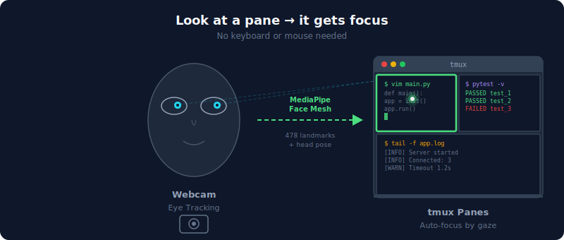
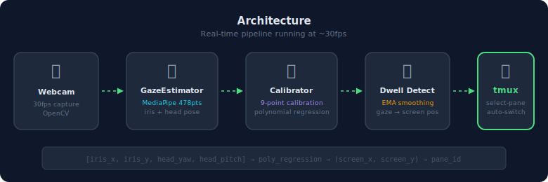

<div align="center">

# 👁️ eye-tracker-tmux

**Look at a tmux pane, and it gets focus.**

Webカメラの視線トラッキングで tmux pane を自動切り替えするmacOS向け実験的ツール。<br>
キーボードもマウスも使わずに、見ているpaneにフォーカスが移動します。

<br>



<br>

[](https://python.org)
[](https://ai.google.dev/edge/mediapipe/solutions/vision/face_landmarker)
[](https://www.apple.com/macos/)
[](LICENSE)

</div>

---

## How It Works



1. **Webcam** — OpenCVで30fpsのカメラ映像をキャプチャ
2. **GazeEstimator** — MediaPipe Face Meshの478ランドマークから虹彩の位置と頭部姿勢（yaw/pitch）を抽出
3. **Calibrator** — 9点GUIキャリブレーションで視線→画面座標の2次多項式回帰モデルを構築
4. **Dwell Detection** — EMA平滑化した視線座標がpane上に0.7秒留まったらフォーカスを切り替え
5. **tmux** — `tmux select-pane` で対象paneをアクティブに（サウンド+ビジュアルフィードバック付き）

## Demo

> **Note:** 実際のデモ動画を撮影したら `assets/demo.gif` に置いて、以下のコメントを解除してください。

<!--  -->

## Quick Start

### Prerequisites

- macOS (Apple Silicon / Intel)
- Python 3.12+
- tmux
- Webカメラ（MacBook内蔵カメラでOK）

### Setup

```bash
git clone https://github.com/yourname/eye-tracker-tmux.git
cd eye-tracker-tmux

python3 -m venv .venv
source .venv/bin/activate  # fish: source .venv/bin/activate.fish
pip install -r requirements.txt
```

MediaPipe FaceLandmarkerモデルのダウンロード（初回のみ、約4MB）:

```bash
curl -sL -o face_landmarker.task \
  "https://storage.googleapis.com/mediapipe-models/face_landmarker/face_landmarker/float16/latest/face_landmarker.task"
```

### Run

tmuxセッション内で実行してください:

```bash
python eye_tracker.py
```

### Calibration

起動すると9点キャリブレーションが自動で始まります。

```
  ●───●───●      フルスクリーンウィンドウに
  │   │   │      緑の点が順番に表示されます。
  ●───●───●      各点を1秒ほど見つめるだけで
  │   │   │      自動的に次に進みます。
  ●───●───●
```

キャリブレーション完了後、デバッグウィンドウにリアルタイムの視線位置が表示されます。

## Options

| Flag | Default | Description |
|------|---------|-------------|
| `--dwell-time` | `0.7` | pane切り替えまでの注視時間（秒） |
| `--smoothing` | `0.2` | 視線の平滑化係数（小さいほど滑らか） |
| `--char-width` | `8.0` | ターミナルの1文字のピクセル幅 |
| `--char-height` | `16.0` | ターミナルの1文字のピクセル高さ |
| `--terminal-x` | `0` | ターミナルウィンドウのX座標 |
| `--terminal-y` | `0` | ターミナルウィンドウのY座標 |
| `--no-preview` | — | デバッグウィンドウを非表示 |
| `--camera` | `0` | カメラデバイス番号 |

### Keybindings

| Key | Action |
|-----|--------|
| `q` | 終了 |
| `c` | 再キャリブレーション |

## Tips for Better Accuracy

- **照明** — 顔が均一に照らされている環境がベスト。逆光は避ける
- **カメラ位置** — ディスプレイの上端中央（MacBook内蔵カメラの位置）が理想的
- **頭の位置** — キャリブレーション後はなるべく頭を動かさない
- **paneサイズ** — 2〜4分割程度の大きめのpaneが認識しやすい
- **dwell time** — 誤切り替えが多い場合は `--dwell-time 1.0` に

## Technical Details

### Gaze Estimation

MediaPipe Face Meshの478ランドマーク（虹彩専用の10点を含む）から、以下の4次元特徴ベクトルを抽出:

```
[iris_ratio_x, iris_ratio_y, head_yaw, head_pitch]
```

- **iris_ratio**: 左右の目それぞれで、眼球内の虹彩位置を目頭・目尻に対する相対比率で算出し平均
- **head_yaw / head_pitch**: 顔の6ランドマークと3Dモデルから `solvePnP` で頭部の回転角を推定

### Calibration Model

9点キャリブレーションデータから、2次多項式回帰で視線→画面座標のマッピングを学習:

```
basis = [ix, iy, yaw, pitch, ix², iy², ix·iy, ix·yaw, iy·pitch, 1]
screen_x = basis · coeffs_x
screen_y = basis · coeffs_y
```

2次の交差項を含めることで、頭の傾きと視線方向の非線形な相互作用をモデリングしています。

## Known Limitations

- Webカメラのみの視線推定のため、専用アイトラッカーと比べて精度に限界があります
- 眼鏡のレンズ反射が虹彩検出に影響する場合があります
- ターミナルの文字→ピクセル変換は近似値です（`--char-width` / `--char-height` で調整可能）

## Roadmap

- [ ] 精度改善（カルマンフィルタ、追加キャリブレーション点）
- [ ] ターミナルウィンドウ位置の自動検出
- [ ] キャリブレーションデータの保存/読み込み
- [ ] Linux対応
- [ ] Webカメラなしでのトラックパッド視線シミュレーション（開発用）

## License

MIT

---

<div align="center">

Built with [MediaPipe](https://ai.google.dev/edge/mediapipe/solutions/vision/face_landmarker) and [OpenCV](https://opencv.org/)

</div>
